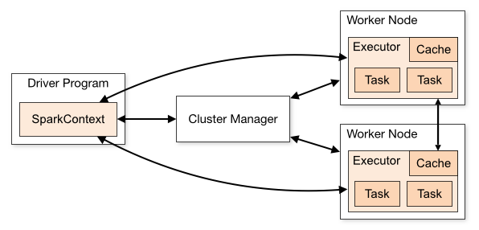

# Revisão dos Conceitos Básicos de DataFrame

**Author:** Prof. Barbosa  
**Contact:** infobarbosa@gmail.com  
**Github:** [infobarbosa](https://github.com/infobarbosa)

---

### Atenção aos custos!
**Atenção!** Ao realizar os laboratórios deste módulo, lembre-se de que a execução na AWS pode gerar custos. A responsabilidade pela gestão desses custos é do aluno.

---

## 1. Introdução
Neste módulo, vamos revisar os conceitos fundamentais do Apache Spark relacionados ao uso de DataFrames. Esta base teórica é essencial para os próximos módulos do curso, onde abordaremos tópicos mais avançados.

### 1.1. Apache Spark
O **Apache Spark** é uma plataforma de computação distribuída de código aberto projetada para processar grandes volumes de dados de forma rápida e eficiente. Ele foi desenvolvido para superar as limitações de desempenho do Hadoop MapReduce, oferecendo um modelo de processamento em memória que reduz significativamente o tempo de execução de tarefas.

### Propósito
O principal objetivo do Apache Spark é fornecer uma estrutura unificada para o processamento de dados em larga escala, permitindo a execução de tarefas como:
- Processamento em lote;
- Processamento em tempo real (streaming);
- Consultas interativas;
- Machine Learning;
- Análise de grafos.

### Principais Elementos da Arquitetura



Crédito: https://spark.apache.org/docs/latest/cluster-overview.html

1. **Driver**: O componente central que coordena a execução do programa Spark. Ele traduz as operações de alto nível em tarefas distribuídas e as envia para os executores.

2. **Executors**: São os processos responsáveis por executar as tarefas atribuídas pelo driver. Cada executor armazena dados em memória e realiza cálculos.

3. **Cluster Manager**: Gerencia os recursos do cluster e aloca nós para o driver e os executores. Exemplos incluem YARN, Mesos e o gerenciador de cluster embutido do Spark.

4. **RDD (Resilient Distributed Dataset)**: A abstração fundamental do Spark, representando um conjunto de dados distribuído e imutável que pode ser processado em paralelo.

5. **Spark SQL**: Um módulo para trabalhar com dados estruturados, permitindo consultas SQL e integração com DataFrames e Datasets.

6. **Spark Streaming**: Um módulo para processamento de dados em tempo real, permitindo a análise contínua de fluxos de dados.

7. **MLlib**: Uma biblioteca de aprendizado de máquina que fornece algoritmos e ferramentas para tarefas como classificação, regressão e clustering.

8. **GraphX**: Um módulo para análise e processamento de grafos.

Esses elementos trabalham juntos para fornecer uma plataforma robusta e escalável para análise de dados em larga escala.

## 2. Conceitos Fundamentais de DataFrame
### 2.1. Criação de DataFrames
Os DataFrames são estruturas de dados distribuídas, imutáveis e organizadas em colunas nomeadas. No Spark, você pode criar DataFrames de várias fontes, como arquivos CSV, JSON, Parquet, tabelas SQL, entre outros.

**Exemplo**

1. Faça o clone do repositório a seguir:
   ```sh
   git clone https://github.com/infobarbosa/datasets-csv-clientes

   ```

   ```
   zcat datasets-csv-clientes/clientes.csv.gz | column -t -s ';' | head -10

   ```

2. Instale o **pyspark**:
   ```
   pip install pyspark

   ```

3. A seguir vamos criar um script `revisao-2.1.py` que carrega o arquivo `clientes.csv.gz`.

   ```sh
   touch revisao-2.1.py

   ```

   ```python
   from pyspark.sql import SparkSession

   # Inicializando a SparkSession
   spark = SparkSession.builder.appName("dataeng-revisao-dataframe").getOrCreate()

   # Criando um DataFrame a partir de um arquivo CSV
   df = spark.read \
         .format("csv") \
         .option("compression", "gzip") \
         .option("sep", ";") \
         .load("./datasets-csv-clientes/clientes.csv.gz", header=True, inferSchema=True)

   # Mostrando o schema
   df.printSchema()

   # Mostrando as primeiras linhas do DataFrame
   df.show()

   ```

   **Execução**
   ```sh
   python revisao-2.1.py
   ```

---

### 2.2. Seleção de Colunas com `select`
A operação `select` no Spark permite selecionar colunas específicas de um DataFrame. Isso é útil quando você deseja trabalhar apenas com um subconjunto dos dados.

**Exemplo**
   ```sh
   touch revisao-2.2.py

   ```

   **Código**
   ```python
   from pyspark.sql import SparkSession

   # Inicializando a SparkSession
   spark = SparkSession.builder.appName("dataeng-select").getOrCreate()

   # Carregando o DataFrame a partir de um arquivo CSV
   df = spark.read \
      .format("csv") \
      .option("sep", ";") \
      .option("header", True) \
      .load("./datasets-csv-clientes/clientes.csv.gz")

   # Selecionando colunas específicas
   df_selected = df.select("id", "nome", "email")

   # Mostrando as primeiras linhas do DataFrame selecionado
   df_selected.show(5, truncate=False)

   ```

   **Execução**
   ```sh
   python revisao-2.2.py
   ```

Neste exemplo, utilizamos a função `select` para escolher apenas as colunas `id`, `nome` e `email` do DataFrame original. Isso pode ser útil para reduzir a quantidade de dados processados ou para focar em informações específicas.


---
### 2.3. Filtragem com `filter`
A operação `filter` no Spark permite filtrar linhas de um DataFrame com base em uma condição específica. Isso é útil para trabalhar apenas com um subconjunto de dados que atende a determinados critérios.

**Exemplo 1**
   ```sh
   touch revisao-2.3.filtro-simples.py

   ```

   **Código**
   ```python
   from pyspark.sql import SparkSession
   from pyspark.sql.functions import col

   # Inicializando a SparkSession
   spark = SparkSession.builder.appName("dataeng-filter").getOrCreate()

   # Carregando o DataFrame a partir de um arquivo CSV
   df = spark.read \
      .format("csv") \
      .option("sep", ";") \
      .option("header", True) \
      .load("./datasets-csv-clientes/clientes.csv.gz")

   # Filtrando linhas onde a data de nascimento é menor ou igual a 1973-01-01
   df_filtrado = df.filter(col("data_nasc") <= "1973-01-01")

   # Mostrando as primeiras linhas do DataFrame filtrado
   df_filtrado.show(5, truncate=False)

   ```

   **Execução**
   ```sh
   python revisao-2.3.filtro-simples.py
   ```

**Exemplo 2 (between)**
   ```sh
   touch revisao-2.3.filtro-between.py

   ```

   **Código**
   ```python
   from pyspark.sql import SparkSession
   from pyspark.sql.functions import col

   # Inicializando a SparkSession
   spark = SparkSession.builder.appName("dataeng-filter").getOrCreate()

   # Carregando o DataFrame a partir de um arquivo CSV
   df = spark.read \
      .format("csv") \
      .option("sep", ";") \
      .option("header", True) \
      .load("./datasets-csv-clientes/clientes.csv.gz")

   # Filtrando pessoas que nasceram entre 1975 e 1980
   df_filtrado = df.filter(col("data_nasc").between("1975-01-01", "1980-12-31"))

   # Mostrando as primeiras linhas do DataFrame filtrado
   df_filtrado.show(5, truncate=False)

   ```

   **Execução**
   ```sh
   python revisao-2.3.filtro-simples.py
   ```

---
### 2.4. Operadores lógicos
Os operadores lógicos no PySpark são usados para combinar ou inverter condições ao filtrar ou manipular dados em DataFrames. Eles permitem criar expressões complexas para selecionar ou transformar dados com base em múltiplos critérios. Os operadores mais comuns incluem `&` (AND), `|` (OR), e `~` (NOT). Esses operadores são aplicados em conjunto com funções como `col` ou expressões de coluna.

**Exemplos de operadores lógicos:**

1. **AND (`&`)**  
   Filtra linhas que atendem a todas as condições especificadas.  
   ```python
   df.filter((col("idade") > 30) & (col("cidade") == "São Paulo")).show()
   ```

2. **OR (`|`)**  
   Filtra linhas que atendem a pelo menos uma das condições especificadas.  
   ```python
   df.filter((col("idade") > 30) | (col("cidade") == "São Paulo")).show()
   ```

3. **NOT (`~`)**  
   Filtra linhas que não atendem a uma condição específica.  
   ```python
   df.filter(~(col("cidade") == "São Paulo")).show()
   ```

**Exemplo 1 (filtro composto )**
   ```sh
   touch revisao-2.4.filtro-composto.py

   ```

   **Código**
   ```python
   from pyspark.sql import SparkSession
   from pyspark.sql.functions import col

   # Inicializando a SparkSession
   spark = SparkSession.builder.appName("dataeng-filter").getOrCreate()

   # Carregando o DataFrame a partir de um arquivo CSV
   df = spark.read \
      .format("csv") \
      .option("sep", ";") \
      .option("header", True) \
      .load("./datasets-csv-clientes/clientes.csv.gz")

   # Filtrando pessoas com nome iniciando por Pedro e nascimento entre 1975 e 1980
   df_filtrado = df.filter(
      (col("data_nasc").between("1975-01-01", "1980-12-31")) &
      (split(col("nome"), " ")[0] == "Pedro")
   )
   
   # Mostrando as primeiras linhas do DataFrame filtrado
   df_filtrado.show(5, truncate=False)

   ```

   **Execução**
   ```sh
   python revisao-2.4.filtro-composto.py
   ```

---
### 2.5. Enriquecimento com `withColumn`


**Exemplo 1**
   ```sh
   touch revisao-2.5.withColumn.py

   ```

   **Código**
   ```python
   from pyspark.sql import SparkSession
   from pyspark.sql.functions import col, split, year, to_date

   # Inicializando a SparkSession
   spark = SparkSession.builder.appName("dataeng-novas-colunas").getOrCreate()

   # Carregando o DataFrame a partir de um arquivo CSV
   df = spark.read \
      .format("csv") \
      .option("sep", ";") \
      .option("header", True) \
      .load("./datasets-csv-clientes/clientes.csv.gz")

   # Convertendo 'data_nasc' para tipo Date
   df = df.withColumn("data_nasc", to_date(col("data_nasc"), "yyyy-MM-dd"))

   # Criando as novas colunas: ano_nasc e primeiro_nome
   df_enriquecido = df \
      .withColumn("ano_nasc", year(col("data_nasc"))) \
      .withColumn("primeiro_nome", split(col("nome"), " ")[0])

   # Mostrando as primeiras linhas do DataFrame enriquecido
   df_enriquecido.select("nome", "data_nasc", "ano_nasc", "primeiro_nome").show(5, truncate=False)

   ```

   **Execução**
   ```sh
   python revisao-2.5.withColumn.py
   ```

**Exemplo 2 (When/Otherwise)**

   No PySpark, as funções when e otherwise são usadas para criar colunas condicionais, de forma semelhante a um if...else ou CASE WHEN no SQL.

   ```sh
   touch revisao-2.5.A-withColumn-When-Otherwise.py

   ```

   **Código**
   ```python
   from pyspark.sql import SparkSession
   from pyspark.sql.functions import col, split, year, to_date, current_date, datediff, when

   # Inicializando a SparkSession
   spark = SparkSession.builder.appName("dataeng-maioridade").getOrCreate()

   # Carregando o DataFrame a partir de um arquivo CSV
   df = spark.read \
      .format("csv") \
      .option("sep", ";") \
      .option("header", True) \
      .load("./datasets-csv-clientes/clientes.csv.gz")

   # Convertendo a coluna data_nasc para tipo Date
   df = df.withColumn("data_nasc", to_date(col("data_nasc"), "yyyy-MM-dd"))

   # Criando a coluna 'maior_de_idade' com base na diferença de dias
   df_com_maioridade = df.withColumn(
      "maior_de_idade",
      when((datediff(current_date(), col("data_nasc")) / 365.25) >= 18, "Sim").otherwise("Não")
   )

   # Visualizando as primeiras linhas com nome, data_nasc e maior_de_idade
   df_com_maioridade.select("nome", "data_nasc", "maior_de_idade").show(5, truncate=False)

   ```

**Exemplo 3 (When/Otherwise)**

   É possível ter diversas cláusulas when no PySpark — e essa é, inclusive, a forma recomendada para simular um if...elif...else ou um CASE WHEN completo do SQL.

   ```sh
   touch revisao-2.5.B-withColumn-When-Otherwise.py

   ```

   **Código**
   ```python
   from pyspark.sql import SparkSession
   from pyspark.sql.functions import col, to_date, current_date, datediff, when

   # Inicializando a SparkSession
   spark = SparkSession.builder.appName("dataeng-faixa-etaria").getOrCreate()

   # Carregando o DataFrame a partir do CSV
   df = spark.read \
      .format("csv") \
      .option("sep", ";") \
      .option("header", True) \
      .load("./datasets-csv-clientes/clientes.csv.gz")

   # Convertendo 'data_nasc' para tipo date
   df = df.withColumn("data_nasc", to_date(col("data_nasc"), "yyyy-MM-dd"))

   # Calculando a idade (diferença em anos, aproximada)
   df = df.withColumn("idade", (datediff(current_date(), col("data_nasc")) / 365.25).cast("int"))

   # Classificando por faixa etária
   df = df.withColumn("faixa_etaria",
      when(col("idade") < 12, "Criança")
      .when(col("idade") < 18, "Adolescente")
      .when(col("idade") < 60, "Adulto")
      .otherwise("Idoso")
   )

   # Mostrando resultado
   df.select("nome", "data_nasc", "idade", "faixa_etaria").show(10, truncate=False)


   ```

   **Execução**
   ```sh
   python revisao-2.5.B-withColumn-When-Otherwise.py
   ```

---

### 2.6. Transformações e Ações
As transformações no Spark são operações "lazy", ou seja, elas não são executadas até que uma ação seja chamada. <br>
Exemplos de transformações incluem `filter`, `select`, `groupBy`, enquanto ações incluem `show`, `count`, `collect`.

```python
# Transformação: Filtrando linhas onde a coluna 'idade' é maior que 30
df_filtered = df.filter(df["idade"] > 30)

# Ação: Contando o número de linhas resultantes
total = df_filtered.count()
print(f"Total de pessoas com mais de 30 anos: {total}")
```

---

## 3. Tipos de Dados e Esquemas
No Spark, o esquema de um DataFrame define as colunas e seus tipos de dados. É possível definir o esquema manualmente ou permitir que o Spark infira automaticamente a partir dos dados.

### 3.1. Tipos de Dados no Spark

O Spark SQL suporta vários tipos de dados que podem ser usados para definir o esquema de um DataFrame. Aqui estão alguns dos tipos de dados mais comuns:

   1. **StringType**: Representa uma string.
   2. **IntegerType**: Representa um número inteiro.
   3. **LongType**: Representa um número inteiro longo.
   4. **FloatType**: Representa um número de ponto flutuante de precisão simples.
   5. **DoubleType**: Representa um número de ponto flutuante de precisão dupla.
   6. **BooleanType**: Representa um valor booleano (True ou False).
   7. **DateType**: Representa uma data (sem hora).
   8. **TimestampType**: Representa uma data e hora.
   9. **ArrayType**: Representa uma lista de elementos de um tipo específico.
   10. **StructType**: Representa um esquema que contém uma lista de campos (StructField).
   11. **MapType**: Representa um mapa de chaves e valores de tipos específicos.

Esses tipos de dados são definidos no módulo `pyspark.sql.types` e são usados para especificar o esquema de um DataFrame.

**Exemplo**
   ```sh
   touch revisao-3.1.data-types.py

   ```

   **Código**
   ```python
   from pyspark.sql import SparkSession
   from pyspark.sql.types import StructType, StructField, StringType, LongType, DateType

   # Inicializando a SparkSession
   spark = SparkSession.builder.appName("dataeng-revisao-dataframe").getOrCreate()

   # Definindo o schema
   schema = StructType([
      StructField("ID", LongType(), True),
      StructField("NOME", StringType(), True),
      StructField("DATA_NASC", DateType(), True),
      StructField("CPF", StringType(), True),
      StructField("EMAIL", StringType(), True)
   ])

   # Criando o dataframe utilizando o schema definido acima
   df = spark.read \
         .format("csv") \
         .option("compression", "gzip") \
         .option("sep", ";") \
         .option("header", True) \
         .load("./datasets-csv-clientes/clientes.csv.gz", schema=schema)

   # Mostrando o schema
   df.printSchema()

   # Mostrando as primeiras linhas do DataFrame
   df.show(10, False)

   ```

   O **StructType** é uma classe do módulo `pyspark.sql.types` usada para definir o esquema de um DataFrame no Apache Spark. Ele representa uma estrutura de dados composta por uma lista de campos, onde cada campo é definido por um objeto **StructField**. Os parâmetros que o **StructType** recebe incluem uma lista de **StructField**, onde cada **StructField** especifica o nome da coluna, o tipo de dado (como `StringType`, `IntegerType`, etc.) e se o campo pode conter valores nulos (`nullable`). Essa abordagem permite criar esquemas personalizados para leitura de dados estruturados, como arquivos CSV ou JSON.

## 4. Exercício 1
**Objetivo:** Definir um esquema personalizado, criar um DataFrame a partir de um arquivo JSON e aplicar uma algumas transformações e ações.

1. Crie o arquivo `data.json` com o seguinte conteúdo:
   ```json
   [
      { "nome": "João"     ,"idade": 25,"cidade": "São Paulo"     },
      { "nome": "Maria"    ,"idade": 30,"cidade": "Rio de Janeiro" },
      { "nome": "Pedro"    ,"idade": 35,"cidade": "Belo Horizonte" },
      { "nome": "Ana"      ,"idade": 28,"cidade": "Brasília"       },
      { "nome": "Lucas"    ,"idade": 22,"cidade": "Salvador"       },
      { "nome": "Mariana"  ,"idade": 27,"cidade": "Porto Alegre"   },
      { "nome": "Carlos"   ,"idade": 33,"cidade": "Fortaleza"      },
      { "nome": "Juliana"  ,"idade": 29,"cidade": "Recife"         },
      { "nome": "Rafael"   ,"idade": 31,"cidade": "Manaus"         },
      { "nome": "Isabela"  ,"idade": 26,"cidade": "Curitiba"       },
      { "nome": "Gustavo"  ,"idade": 24,"cidade": "Florianópolis"  },
      { "nome": "Laura"    ,"idade": 32,"cidade": "Goiania"        },
      { "nome": "Fernando" ,"idade": 23,"cidade": "Vitória"        },
      { "nome": "Camila"   ,"idade": 34,"cidade": "Natal"          },
      { "nome": "Diego"    ,"idade": 27,"cidade": "Cuiabá"         },
      { "nome": "Amanda"   ,"idade": 29,"cidade": "João Pessoa"    },
      { "nome": "Rodrigo"  ,"idade": 25,"cidade": "Aracaju"        },
      { "nome": "Larissa"  ,"idade": 30,"cidade": "Teresina"       },
      { "nome": "Thiago"   ,"idade": 28,"cidade": "Maceió"         },
      { "nome": "Patrícia" ,"idade": 26,"cidade": "Macapá"         },
      { "nome": "Henrique" ,"idade": 33,"cidade": "Boa Vista"      },
      { "nome": "Carolina" ,"idade": 31,"cidade": "Palmas"         },
      { "nome": "Renata"   ,"idade": 24,"cidade": "Rio Branco"     },
      { "nome": "Bruno"    ,"idade": 32,"cidade": "Porto Velho"    },
      { "nome": "Marina"   ,"idade": 55,"cidade": "São Luís"       },
      { "nome": "Carlota"  ,"idade": 45,"cidade": "Belém"          },
      { "nome": "Juliete"  ,"idade": 40,"cidade": "Boa Vista"      },
      { "nome": "Rafaela"  ,"idade": 41,"cidade": "Palmas"         },
      { "nome": "Isabel"   ,"idade": 46,"cidade": "Rio Branco"     },
      { "nome": "Augusto"  ,"idade": 44,"cidade": "Porto Velho"    },
      { "nome": "Laura"    ,"idade": 52,"cidade": "São Luís"       },
      { "nome": "Wilson"   ,"idade": 43,"cidade": "Belém"          },
      { "nome": "Beatriz"  ,"idade": 54,"cidade": "Macapá"         },
      { "nome": "Diogenes" ,"idade": 47,"cidade": "Maceió"         },
      { "nome": "Amanda"   ,"idade": 49,"cidade": "Teresina"       },
      { "nome": "Rodrigo"  ,"idade": 45,"cidade": "Aracaju"        },
      { "nome": "Larissa"  ,"idade": 50,"cidade": "João Pessoa"    },
      { "nome": "Thiago"   ,"idade": 48,"cidade": "Cuiabá"         },
      { "nome": "Patrícia" ,"idade": 46,"cidade": "Natal"          },
      { "nome": "Marta"    ,"idade": 53,"cidade": "Vitória"        },
      { "nome": "Emilia"   ,"idade": 51,"cidade": "Florianópolis"  },
      { "nome": "Jucilene" ,"idade": 44,"cidade": "Goiania"        },
      { "nome": "Marivalda","idade": 52,"cidade": "Curitiba"       }
   ]
   ```

2. Crie o script `revisao-4-exercicio-1.py` que realiza as seguintes etapas:
   - Carrega o arquivo JSON de exemplo.
   - Aplica transformações para filtrar e agrupar dados.
   - Define um esquema personalizado para o DataFrame.
   - Exibe o resultado final das transformações.

   ```sh
   touch revisao-4-exercicio-1.py

   ```

   **Código**
   ```python
   from pyspark.sql import SparkSession
   from pyspark.sql.types import StructType, StructField, StringType, IntegerType

   # Iniciar uma sessão Spark
   spark = SparkSession.builder.appName("dataeng-pyspark").getOrCreate()

   # Esquema personalizado
   schema_custom = StructType([
      StructField("nome", StringType(), True),
      StructField("idade", IntegerType(), True),
      StructField("cidade", StringType(), True)
   ])

   df_json = spark.read.json("data.json", schema=schema_custom, multiLine=True)
   df_json.show(10, False)
   df_json.printSchema()

   # Transformações e ações
   df_result = df_json.filter(df_json["idade"] > 25).groupBy("cidade").count()

   # Mostrando o resultado
   df_result.show(10, False)
   df_result.printSchema()

   ```

3. Execute o script:
   ```sh
   python revisao-4-exercicio-1.py

   ```

## 5. Desafio
Contagem da quantidade de clientes nascidos por ano.

Elabore o script pyspark para:
- abrir o arquivo `clientes.csv.gz`;
- filtrar todos os clientes com mais de 50 anos; 
- agrupar por ano de nascimento;
- apresentar em ordem decrescente de quantidade por ano.

#### A base de dados
Faça o clone do dataset `clientes.csv.gz`
```sh
git clone https://github.com/infobarbosa/datasets-csv-clientes

```

#### O leiaute 

- Separador: ";"
- Header: True
- Compressão: gzip

#### Os atributos
| Atributo        | Tipo      | Obs                                               |
| ---             | ---       | ---                                               |
| ID              | long      | O identificador da pessoa                         |
| NOME            | string    | O nome da pessoa                                  |
| DATA_NASC       | date      | A data de nascimento da pessoa                    |
| CPF             | string    | O CPF da pessoa                                   |
| EMAIL           | string    | O email da pessoa                                 |

#### Amostra

```
id;nome;data_nasc;cpf;email
1;Isabelly Barbosa;1963-08-15;137.064.289-03;isabelly.barbosa@example.com<br>
2;Larissa Fogaça;1933-09-29;703.685.294-10;larissa.fogaca@example.com<br>
3;João Gabriel Silveira;1958-05-27;520.179.643-52;joao.gabriel.silveira@example.com<br>
4;Pedro Lucas Nascimento;1950-08-23;274.351.896-00;pedro.lucas.nascimento@example.com<br>
5;Felipe Azevedo;1986-12-31;759.061.842-01;felipe.azevedo@example.com<br>
6;Ana Laura Lopes;1963-04-27;165.284.390-60;ana.laura.lopes@example.com<br>
7;Ana Beatriz Aragão;1958-04-21;672.135.804-26;ana.beatriz.aragao@example.com<br>
8;Murilo da Rosa;1944-07-13;783.640.251-71;murilo.da.rosa@example.com<br>
9;Alícia Souza;1960-08-26;784.563.029-29;alicia.souza@example.com<br>
```

#### Dica 1
O arquivo é do tipo `csv` então utilize:
- o método `read.csv` para abrir o arquivo;
- o parâmetro `sep` para especificar o separador ponto-e-vírgula;
- o parâmetro `header` como **True** ou **False** caso o arquivo possua cabeçalho.

Exemplo:
```python
df_clientes = spark.read.csv("nome_do_arquivo.csv", sep=";", header=True, ...outros parâmetros...)
```

#### Dica 2
Para resolver o desafio, você pode utilizar a função `year` do pacote `pyspark.sql.functions` para extrair o ano de nascimento dos clientes. <br>
Exemplo:

```python
# Filtrar clientes com mais de 25 anos
df_filtrado = df_clientes.filter(year("data_nasc") <= 1996)
```

#### Dica 3
Para resolver o desafio, você pode adicionar uma coluna `IDADE` ao DataFrame para facilitar o filtro dos clientes com mais de 50 anos. <br>
A função `withColumn` serve para adicionar novas colunas ao DataFrame.

Exemplo:

```python
# Adicionar coluna IDADE
df_clientes = df_clientes.withColumn("IDADE", 2023 - year(col("data_nasc")))
```

#### Dica 4
Para calcular a idade com base na data atual, você pode utilizar as funções `current_date` e `datediff` do pacote `pyspark.sql.functions`. <br>
Exemplo:

```python
from pyspark.sql.functions import current_date, datediff

# Adicionar coluna IDADE calculada com base na data atual
df_clientes = df_clientes.withColumn("IDADE", (datediff(current_date(), col("data_nasc")) / 365.25).cast("int"))
```

Neste exemplo, a função `year` é usada para extrair o ano da coluna `data_nasc`, permitindo que você agrupe os dados por ano de nascimento.


## 6. Parabéns!
Parabéns por concluir o módulo! Você revisou os conceitos fundamentais de DataFrames no Apache Spark e praticou com transformações, ações e manipulação de esquemas.

## 7. Destruição dos recursos
Para evitar custos desnecessários, lembre-se de destruir os recursos criados durante este módulo:
- Exclua quaisquer instâncias do AWS Cloud9 que não sejam mais necessárias.
- Remova dados temporários ou resultados intermediários armazenados no S3.
