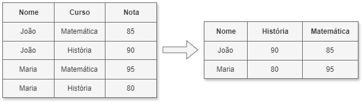

# Manipulação Avançada de DataFrame - Pivot e Unpivot

**Author:** Prof. Barbosa  
**Contact:** infobarbosa@gmail.com  
**Github:** [infobarbosa](https://github.com/infobarbosa)

---

#### Atenção aos custos!
**Atenção!** Ao realizar os laboratórios deste módulo, lembre-se de que a execução na AWS pode gerar custos. A responsabilidade pela gestão desses custos é do aluno.

---

## 1. Introdução
Neste módulo, exploraremos técnicas avançadas de manipulação de DataFrames no Apache Spark. Abordaremos transformações complexas como pivot e unpivot.
O pivot transforma valores únicos de uma coluna em múltiplas colunas, enquanto o unpivot faz o processo inverso.

## 2. Exemplo



**Exemplo de código:**
```python
from pyspark.sql import SparkSession
from pyspark.sql.functions import explode, col
from pyspark.sql.types import StructType, StructField, StringType, IntegerType, ArrayType

# Iniciar uma sessão Spark
spark = SparkSession.builder.appName("DesafioPySpark").getOrCreate()

from pyspark.sql.functions import explode, col

# Exemplo de DataFrame com arrays e structs
data = [
    ("João", [{"curso": "MATEMATICA", "nota": 85}, {"curso": "HISTORIA", "nota": 90}]),
    ("Maria", [{"curso": "MATEMATICA", "nota": 95}, {"curso": "HISTORIA", "nota": 80}])
]
schema = StructType([
    StructField("nome", StringType(), True),
    StructField("cursos", ArrayType(StructType([
        StructField("curso", StringType(), True),
        StructField("nota", IntegerType(), True)
    ])), True)
])
df = spark.createDataFrame(data, schema)

df.show( truncate=False)

# Explodindo o array para linhas individuais
df_exploded = df.withColumn("curso", explode(df["cursos"]))
df = df_exploded.select("nome", col("curso.curso"), col("curso.nota"))

df.show()

print('Exemplo de Pivot')
df_pivot = df.groupBy("nome").pivot("curso").agg({"nota": "max"})
df_pivot.show()

print('Exemplo de Unpivot (Requer manipulação manual no PySpark')
unpivoted = df_pivot.selectExpr("nome", "stack(2, 'Matematica', MATEMATICA, 'Historia', HISTORIA) as (curso, nota)")
unpivoted.show()
```

## 3. Desafio

Você recebeu um dataset contendo 5 colunas:
- Produto
- Vendas no 1o trimestre
- Vendas no 2o trimestre
- Vendas no 3o trimestre
- Vendas no 4o trimestre

DataFrame Original:
```
+----------+---+---+---+---+                                                    
|   Produto| Q1| Q2| Q3| Q4|
+----------+---+---+---+---+
| GELADEIRA|100|200|300|200|
| TELEVISAO|400|500|600|400|
|COMPUTADOR|700|800|900|950|
+----------+---+---+---+---+
```

Dado o script a seguir, elabore a expressão `unpivot_expr` de forma que um novo dataframe contendo as colunas:
- Produto
- Trimestre (Q1, Q2, Q3, Q4)
- Vendas

Resultado esperado:
```
+----------+---------+------+
|   Produto|Trimestre|Vendas|
+----------+---------+------+
| GELADEIRA|       Q1|   100|
| GELADEIRA|       Q2|   200|
| GELADEIRA|       Q3|   300|
| GELADEIRA|       Q4|   200|
| TELEVISAO|       Q1|   400|
| TELEVISAO|       Q2|   500|
| TELEVISAO|       Q3|   600|
| TELEVISAO|       Q4|   400|
|COMPUTADOR|       Q1|   700|
|COMPUTADOR|       Q2|   800|
|COMPUTADOR|       Q3|   900|
|COMPUTADOR|       Q4|   950|
+----------+---------+------+
```

```python
from pyspark.sql import SparkSession
from pyspark.sql.functions import expr

# Criar sessão do Spark
spark = SparkSession.builder.appName("dataeng-unpivot").getOrCreate()

# Dados de exemplo em um DataFrame
data = [
    ("GELADEIRA" , 100, 200, 300, 200),
    ("TELEVISAO" , 400, 500, 600, 400),
    ("COMPUTADOR", 700, 800, 900, 950)
]

columns = ["Produto", "Q1", "Q2", "Q3", "Q4"]

# Criar DataFrame
df = spark.createDataFrame(data, columns)

# Exibir DataFrame original
print("DataFrame Original:")
df.show()

# Usar selectExpr para simular unpivot (melt)
unpivot_expr = """
DESENVOLVA A EXPRESSAO AQUI!
"""

# Realizando unpivot
df_unpivot = df.select("Produto", expr(unpivot_expr))

# Exibir DataFrame após unpivot
print("DataFrame Após Unpivot:")
df_unpivot.show()

```

## 4. Parabéns!
Parabéns por concluir o módulo! Você aprendeu técnicas de manipulação de DataFrames no Apache Spark, aplicando as operações **pivot** e **unpivot**.

## 5. Destruição dos recursos
Para evitar custos desnecessários, lembre-se de destruir os recursos criados durante este módulo:
- Exclua quaisquer instâncias do AWS Cloud9 que não sejam mais necessárias.
- Remova dados temporários ou resultados intermediários armazenados no S3.

