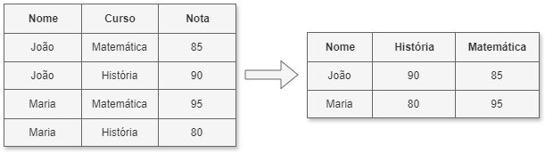

# Manipulação Avançada de DataFrame - Pivot e Unpivot

**Author:** Prof. Barbosa  
**Contact:** infobarbosa@gmail.com  
**Github:** [infobarbosa](https://github.com/infobarbosa)

---

#### Atenção aos custos!
**Atenção!** Ao realizar os laboratórios deste módulo, lembre-se de que a execução na AWS pode gerar custos. A responsabilidade pela gestão desses custos é do aluno.

---

## 1. Introdução
Neste módulo, exploraremos técnicas avançadas de manipulação de DataFrames no Apache Spark. Abordaremos transformações complexas como pivot e unpivot.
O pivot transforma valores únicos de uma coluna em múltiplas colunas, enquanto o unpivot faz o processo inverso.

## 2. Pivot



```python
from pyspark.sql import SparkSession
from pyspark.sql.types import StructType, StructField, StringType, IntegerType

# Iniciar uma sessão Spark
spark = SparkSession.builder.appName("DesafioPySpark").getOrCreate()

# Exemplo de DataFrame com arrays e structs
data = [
    ("João", "matematica", 85),
    ("João", "historia", 90),
    ("João", "portugues", 70),
    ("Maria", "matematica", 95),
    ("Maria", "historia", 80),
    ("Maria", "portugues", None),
    ("Barbosa", "matematica", 75),
    ("Barbosa", "historia", 85),
    ("Barbosa", "portugues", 90)
]
schema = StructType([
    StructField("nome", StringType(), True),
    StructField("curso", StringType(), True),
    StructField("nota", IntegerType(), True)
])
df = spark.createDataFrame(data, schema)

df.show( truncate=False)

print('### PIVOT ###')
df_pivot = df.groupBy("nome").pivot("curso").agg({"nota": "sum"})
df_pivot.show()

```

**Dataframe original:**
```
+-------+----------+----+                                                       
|nome   |curso     |nota|
+-------+----------+----+
|João   |matematica|85  |
|João   |historia  |90  |
|João   |portugues |70  |
|Maria  |matematica|95  |
|Maria  |historia  |80  |
|Maria  |portugues |NULL|
|Barbosa|matematica|75  |
|Barbosa|historia  |85  |
|Barbosa|portugues |90  |
+-------+----------+----+
```

Output esperado após o pivot:
```
+-------+--------+----------+---------+
|   nome|historia|matematica|portugues|
+-------+--------+----------+---------+
|   João|      90|        85|       70|
|  Maria|      80|        95|     NULL|
|Barbosa|      85|        75|       90|
+-------+--------+----------+---------+
```

---

## 3. Transpose
O método `transpose()` (introduzido no Spark 4.0.0) tem a função de inverter a orientação de um DataFrame, transformando linhas em colunas e colunas em linhas. É uma operação geométrica que rotaciona a matriz de dados, utilizando uma coluna de índice como referência para os novos cabeçalhos.

### Diferença para o método `pivot()`
Enquanto o `pivot()` é focado em **remodelar e agregar** dados (transformando valores únicos de uma coluna categórica em novas colunas, geralmente reduzindo o número de linhas), o `transpose()` foca na **rotação** estrutural pura. No `pivot`, o número de novas colunas depende da cardinalidade da coluna escolhida; no `transpose`, cada linha original se torna uma coluna (exceto a coluna de índice).

### Cautelas ao usar `transpose()`
1.  **Explosão de Colunas (Wide DataFrames):** O Spark é otimizado para processar bilhões de linhas, mas sofre com tabelas que possuem milhares de colunas. Como o `transpose` transforma linhas em colunas, aplicar isso em um DataFrame grande resultará em um esquema excessivamente largo, causando degradação de performance ou erros de memória no Driver.
2.  **Compatibilidade de Tipos:** Ao transpor, os valores que antes estavam em colunas diferentes (ex: `matematica` e `historia`) passarão a ocupar a mesma coluna na nova estrutura. Portanto, as colunas originais devem ter tipos de dados compatíveis (ex: todos inteiros). Se houver tipos mistos, o Spark tentará fazer o *cast* para um tipo comum (geralmente String).
3.  **Versão:** Certifique-se de estar utilizando o Spark 4.0.0 ou superior.

```python
from pyspark.sql import SparkSession
from pyspark.sql.functions import explode, col
from pyspark.sql.types import StructType, StructField, StringType, IntegerType, ArrayType

# Iniciar uma sessão Spark
spark = SparkSession.builder.appName("DesafioPySpark").getOrCreate()

from pyspark.sql.functions import explode, col

# Exemplo de DataFrame com arrays e structs
data = [
    ("João", 85, 90, 70),
    ("Maria", 95, 80, None),
    ("Barbosa", 75, 85, 90)
]
schema = StructType([
    StructField("aluno", StringType(), True),
    StructField("matematica", IntegerType(), True),
    StructField("historia", IntegerType(), True),
    StructField("portugues", IntegerType(), True)
])
df = spark.createDataFrame(data, schema)

df.show( truncate=False)

# Disponível a partir do Spark 4.0.0
df_transposto = df.transpose(indexColumn="aluno")
df_transposto.show( truncate=False)

```

**Dataframe original:**
```
+-------+----------+--------+---------+                                         
|aluno  |matematica|historia|portugues|
+-------+----------+--------+---------+
|João   |85        |90      |70       |
|Maria  |95        |80      |NULL     |
|Barbosa|75        |85      |90       |
+-------+----------+--------+---------+
```

Output esperado após o transpose:
```
+----------+-------+----+-----+
|key       |Barbosa|João|Maria|
+----------+-------+----+-----+
|matematica|75     |85  |95   |
|historia  |85     |90  |80   |
|portugues |90     |70  |NULL |
+----------+-------+----+-----+
```
---

## 4. Unpivot

O processo de unpivot é utilizado para transformar colunas em linhas, o que pode ser útil para normalizar dados ou prepará-los para análises específicas. No PySpark, essa operação pode ser realizada utilizando a função `selectExpr` com a expressão `stack`.

**Exemplo de código:**

Considere o seguinte DataFrame:

```python
from pyspark.sql import SparkSession
from pyspark.sql.types import StructType, StructField, StringType, IntegerType

# Iniciar uma sessão Spark
spark = SparkSession.builder.appName("DesafioPySpark").getOrCreate()

# Exemplo de DataFrame com arrays e structs
data = [
    ("João", 85, 90, 70),
    ("Maria", 95, 80, None),
    ("Barbosa", 75, 85, 90)
]
schema = StructType([
    StructField("aluno", StringType(), True),
    StructField("matematica", IntegerType(), True),
    StructField("historia", IntegerType(), True),
    StructField("portugues", IntegerType(), True)
])
df = spark.createDataFrame(data, schema)

df.show( truncate=False)

print('### UNPIVOT 1 ###')
unpivot_expression = "stack(3, 'Matemática', matematica, 'História', historia, 'Português', portugues) as (Disciplina, Nota)"
df_unpivot = df.selectExpr("aluno", unpivot_expression)
df_unpivot.show( truncate=False)

print('### UNPIVOT 2 ###')
# O unpivot é mais limpo e legível, mas só está disponível no Spark 4.0.0+
df_unpivot = df.unpivot("aluno", ["matematica", "historia", "portugues"], "Disciplina", "Nota")
df_unpivot.show( truncate=False)

```

**Dataframe original:**
```
+-------+----------+--------+---------+                                         
|aluno  |matematica|historia|portugues|
+-------+----------+--------+---------+
|João   |85        |90      |70       |
|Maria  |95        |80      |NULL     |
|Barbosa|75        |85      |90       |
+-------+----------+--------+---------+
```

Output:
```
+-------+----------+----+
|aluno  |Disciplina|Nota|
+-------+----------+----+
|João   |matematica|85  |
|João   |historia  |90  |
|João   |portugues |70  |
|Maria  |matematica|95  |
|Maria  |historia  |80  |
|Maria  |portugues |NULL|
|Barbosa|matematica|75  |
|Barbosa|historia  |85  |
|Barbosa|portugues |90  |
+-------+----------+----+
```

Para realizar o unpivot e transformar os trimestres em linhas, utilizamos a expressão `stack`. <br>
A sintaxe da função stack é:
```
stack(n, coluna1, valor1, coluna2, valor2, ..., colunaN, valorN) as (nome_coluna1, nome_coluna2, ..., nome_colunaN)
```

- `n` é o número de colunas que você deseja empilhar.
- Cada par subsequente representa o nome que será atribuído na nova coluna e o valor correspondente.

Exemplo:
```
unpivot_expr = "stack(3, 'produto_A', produto_A, 'produto_B', produto_B, 'produto_C', produto_C) as (produto, valor)"
```

---

## 4. Desafio 1 - Pivot
Examine o dataset a seguir:
```
+-----------------+----+------+
|categoria_produto|ano |vendas|
+-----------------+----+------+
|Eletrônicos      |2022|1000  |
|Eletrônicos      |2023|1500  |
|Eletrônicos      |2024|400   |
|Móveis           |2022|700   |
|Móveis           |2023|800   |
|Móveis           |2024|200   |
|Vestuário        |2022|500   |
|Vestuário        |2023|600   |
|Vestuário        |2024|300   |
+-----------------+----+------+
```

Utilizando a função `pivot`, faça a transposição dos dados e obtenha a `soma` das vendas por `ano` agrupando pelo atributo `categoria_produto`.

Output esperado:
```
+-----------------+----+----+----+                                              
|categoria_produto|2022|2023|2024|
+-----------------+----+----+----+
|           Móveis| 700| 800| 200|
|      Eletrônicos|1000|1500| 400|
|        Vestuário| 500| 600| 300|
+-----------------+----+----+----+

```

**Código inicial**

```python
from pyspark.sql import SparkSession
from pyspark.sql.functions import sum

# Inicializando a sessão do Spark
spark = SparkSession.builder.appName("dataeng-pivot").getOrCreate()

data = [
    ("Eletrônicos", 2022, 1000),
    ("Eletrônicos", 2023, 1500),
    ("Eletrônicos", 2024, 400),
    ("Móveis", 2022, 700),
    ("Móveis", 2023, 800),
    ("Móveis", 2024, 200),
    ("Vestuário", 2022, 500),
    ("Vestuário", 2023, 600),
    ("Vestuário", 2024, 300)
]

# Definir as colunas do DataFrame
columns = ["categoria_produto", "ano", "vendas"]

# Criando o DataFrame com os dados fornecidos
df = spark.createDataFrame(data, columns)

# Utilizando a função `pivot`, faça a transposição dos dados e 
# obtenha a `soma` das vendas por `ano` agrupando pelo atributo `categoria_produto`.
df_pivot = ESCREVA SUA LOGICA AQUI 

# Mostrar o resultado
df_pivot.show()

```

---

## 5. Desafio 2 - Unpivot

Você recebeu um dataset contendo 5 colunas:
- Produto
- Vendas no 1o trimestre
- Vendas no 2o trimestre
- Vendas no 3o trimestre
- Vendas no 4o trimestre

DataFrame Original:
```
+----------+---+---+---+---+                                                    
|   Produto| Q1| Q2| Q3| Q4|
+----------+---+---+---+---+
| GELADEIRA|100|200|300|200|
| TELEVISAO|400|500|600|400|
|COMPUTADOR|700|800|900|950|
+----------+---+---+---+---+
```

Dado o script a seguir, elabore a expressão `unpivot_expr` de forma que um novo dataframe contendo as colunas:
- Produto
- Trimestre (Q1, Q2, Q3, Q4)
- Vendas

Resultado esperado:
```
+----------+---------+------+
|   Produto|Trimestre|Vendas|
+----------+---------+------+
| GELADEIRA|       Q1|   100|
| GELADEIRA|       Q2|   200|
| GELADEIRA|       Q3|   300|
| GELADEIRA|       Q4|   200|
| TELEVISAO|       Q1|   400|
| TELEVISAO|       Q2|   500|
| TELEVISAO|       Q3|   600|
| TELEVISAO|       Q4|   400|
|COMPUTADOR|       Q1|   700|
|COMPUTADOR|       Q2|   800|
|COMPUTADOR|       Q3|   900|
|COMPUTADOR|       Q4|   950|
+----------+---------+------+
```

```python
from pyspark.sql import SparkSession
from pyspark.sql.functions import expr

# Criar sessão do Spark
spark = SparkSession.builder.appName("dataeng-unpivot").getOrCreate()

# Dados de exemplo em um DataFrame
data = [
    ("GELADEIRA" , 100, 200, 300, 200),
    ("TELEVISAO" , 400, 500, 600, 400),
    ("COMPUTADOR", 700, 800, 900, 950)
]

columns = ["Produto", "Q1", "Q2", "Q3", "Q4"]

# Criar DataFrame
df = spark.createDataFrame(data, columns)

# Exibir DataFrame original
print("DataFrame Original:")
df.show()

# Usar selectExpr para simular unpivot (melt)
unpivot_expr = """
DESENVOLVA A EXPRESSAO AQUI!
"""

# Realizando unpivot
df_unpivot = df.select("Produto", expr(unpivot_expr))

# Exibir DataFrame após unpivot
print("DataFrame Após Unpivot:")
df_unpivot.show()

```

## 6. Parabéns!
Parabéns por concluir o módulo! Você aprendeu técnicas de manipulação de DataFrames no Apache Spark, aplicando as operações **Pivot** e **Unpivot**.

## 7. Destruição dos recursos
Para evitar custos desnecessários, lembre-se de destruir os recursos criados durante este módulo:
- Exclua quaisquer instâncias do AWS Cloud9 que não sejam mais necessárias.
- Remova dados temporários ou resultados intermediários armazenados no S3.
